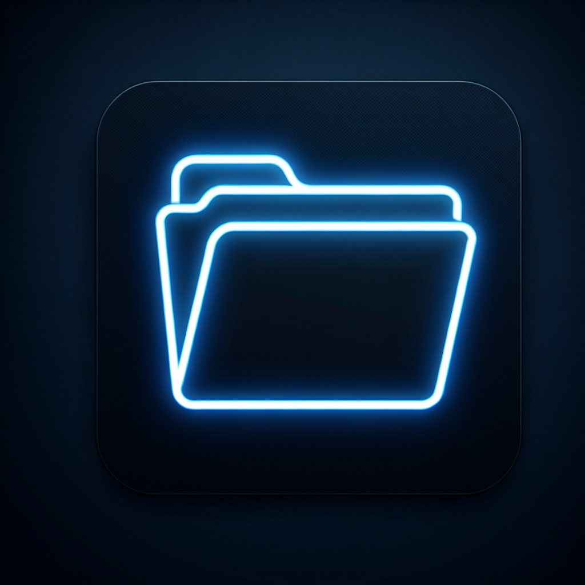

# SwissAirDry Plattform

Ein umfassendes IoT-System zur Überwachung und Steuerung von Trocknungsgeräten mit ESP8266/ESP32-Hardware.



## Überblick

SwissAirDry ist eine vollständige IoT-Lösung, die Backend-APIs, MQTT-Kommunikation, PostgreSQL-Datenbank und ESP32/ESP8266-Geräte integriert. Das System bietet Web-Dashboards zur Geräteverwaltung, Statusüberwachung und Konfiguration. IoT-Geräte umfassen Wemos D1 Mini mit Displayfunktionen (64px und 128px-Varianten), die den Gerätestatus und QR-Codes für einfachen Zugriff anzeigen.

Die Plattform enthält jetzt auch eine Nextcloud-Integration über die ExApp (External App)-Architektur, die eine nahtlose Verbindung zwischen dem SwissAirDry-Ökosystem und Nextcloud-Diensten bietet.

## Hauptkomponenten

- **Flask-Backend**: Stellt API-Endpunkte und Weboberfläche bereit
- **MQTT-Kommunikation**: Ermöglicht Echtzeitkommunikation mit IoT-Geräten
- **PostgreSQL-Datenbank**: Speichert Gerätedaten, Sensormesswerte und Konfigurationen
- **ESP8266/ESP32-Firmware**: Für verschiedene Hardwarekonfigurationen optimiert
- **Nextcloud-Integration**: ExApp zur Integration in Nextcloud-Umgebungen

## Funktionen

- Echtzeit-Überwachung und -Steuerung von Trocknungsgeräten
- Geräteverwaltung mit automatischer Erkennung
- Speicherung von Sensordaten (Temperatur, Feuchtigkeit, Druck, Lüftergeschwindigkeit, Stromverbrauch)
- Over-the-Air (OTA) Firmware-Updates
- QR-Code-Display für einfachen Zugang zu Geräteinformationen
- Responsive Web-Benutzeroberfläche
- Nextcloud-Integration für erweiterte Funktionen

## Systemarchitektur

```
+------------------+      +------------------+     +-------------------+
|                  |      |                  |     |                   |
|   IoT-Geräte     |<---->|   MQTT-Broker    |<--->|   Flask-Backend   |
| (ESP8266/ESP32)  |      | (Mosquitto)      |     | (API/Webinterface)|
|                  |      |                  |     |                   |
+------------------+      +------------------+     +--------+----------+
                                                           |
                                                           v
                               +-------------+    +-------------------+
                               |             |    |                   |
                               |  Nextcloud  |<-->|   PostgreSQL DB   |
                               |   ExApp     |    |                   |
                               |             |    |                   |
                               +-------------+    +-------------------+
```

## Installation

### Voraussetzungen

- Docker und Docker Compose
- Oder: Python 3.8+ und PostgreSQL
- MQTT-Broker (Mosquitto)
- ESP8266/ESP32 mit Unterstützung für die notwendigen Sensoren

### Docker-Installation

1. Repository klonen:
   ```bash
   git clone https://github.com/yourusername/swissairdry.git
   cd swissairdry
   ```

2. Docker Compose starten:
   ```bash
   docker-compose up -d
   ```

3. Die Webanwendung ist unter http://localhost:5000 verfügbar.

### Manuelle Installation

1. Repository klonen:
   ```bash
   git clone https://github.com/yourusername/swissairdry.git
   cd swissairdry
   ```

2. Abhängigkeiten installieren:
   ```bash
   pip install -r requirements.txt
   ```

3. PostgreSQL-Datenbank einrichten.

4. Umgebungsvariablen konfigurieren (siehe `.env.example`).

5. Server starten:
   ```bash
   gunicorn --bind 0.0.0.0:5000 main:app
   ```

## Firmware-Installation

Die Firmware für ESP8266/ESP32-Geräte befindet sich im Ordner `firmware/`. Folgen Sie den Anweisungen in der entsprechenden README-Datei in diesem Verzeichnis.

## Konfiguration

### MQTT-Einstellungen

Die MQTT-Konfiguration kann über Umgebungsvariablen oder direkt in der `mqtt/config/mosquitto.conf`-Datei angepasst werden.

### Datenbank-Einstellungen

Die Datenbankeinstellungen werden über Umgebungsvariablen konfiguriert. Siehe `.env.example` für die verfügbaren Optionen.

## API-Dokumentation

Die API-Endpunkte ermöglichen die Verwaltung von Geräten, Sensordaten und Konfigurationen. Eine detaillierte Dokumentation ist unter `/api/docs` verfügbar, wenn der Server läuft.

## Nextcloud-Integration

Die SwissAirDry-Plattform kann in Nextcloud integriert werden. Dazu müssen Sie:

1. Die ExApp in Ihrer Nextcloud-Instanz installieren
2. Den ExApp-Daemon konfigurieren, um mit der SwissAirDry-API zu kommunizieren

## Lizenz

Dieses Projekt ist unter der MIT-Lizenz lizenziert. Weitere Informationen finden Sie in der LICENSE-Datei.

## Autoren

- Ihre Namen und Kontaktinformationen

## Mitwirken

Beiträge zum Projekt sind willkommen! Bitte erstellen Sie einen Fork des Repositories und reichen Sie Pull Requests ein.